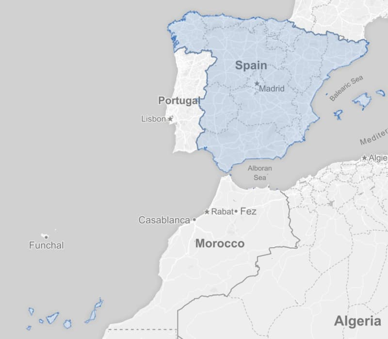
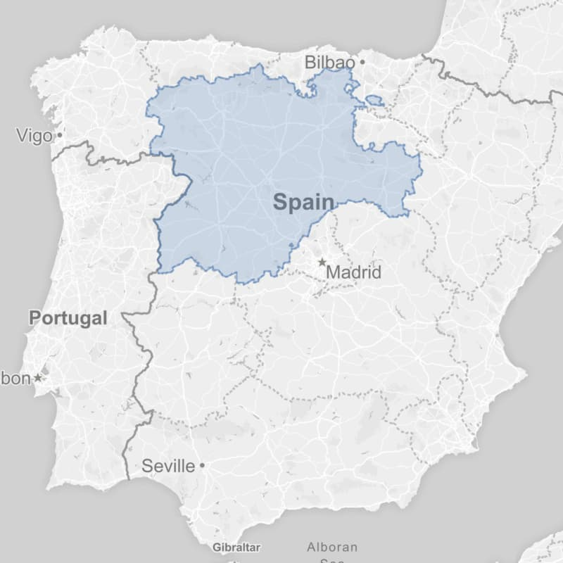

# Country Levels

Country Levels project contains full planet GeoJSON extracts, based on ISO and FIPS codes.

International data is based on OpenStreetMap and Wikidata. US data is from on US Census Bureau.

Both include up-to-date population numbers.

#### [ISO country code list](https://github.com/hyperknot/country-levels-export/blob/master/docs/iso1_list.md)

ISO1 is referring to [ISO 3166-1](https://en.wikipedia.org/wiki/ISO_3166-1) country codes, for example `ES` for Spain.

ISO2 is referring to [ISO 3166-2](https://en.wikipedia.org/wiki/ISO_3166-2) country codes, for example `ES-CL` for Castilla y León, Spain.

GeoJSON files are served in different quality levels, *q5* refers to smallest, *q7* to medium and *q8* to higher quality extracts.

You can download the full planet dataset in ZIP in the [releases](https://github.com/hyperknot/country-levels/releases) tab.

GeoJSON files and JSON catalogs are also browsable in the [export](https://github.com/hyperknot/country-levels-export) repo.

#### [ISO country code list](https://github.com/hyperknot/country-levels-export/blob/master/docs/iso1_list.md)
#### [US county list (FIPS codes)](https://github.com/hyperknot/country-levels-export/blob/master/docs/fips_list.md)

<!--[BR municipality list (IBGE codes)](https://github.com/hyperknot/country-levels-export/blob/master/docs/br_muni_list.md)-->

### Country Level IDs

Country level IDs are optional and are included with each GeoJSON. They simply concatenate the level + the ISO code with `:`

For example:

- Spain is `iso1:ES`
- Castilla y León is `iso2:ES-CL`
- Santa Clara County, CA is `fips:06085`

### License

The source code of this project is licensed under the MIT License.

The GeoJSON files are from OpenStreetMap, [© OpenStreetMap contributors](https://www.openstreetmap.org/copyright).

Population information and corrections are from [Wikidata](https://www.wikidata.org/wiki/Wikidata:Main_Page), Public Domain [Creative Commons CC0 License](https://creativecommons.org/publicdomain/zero/1.0/).

The US County shapes and FIPS codes are from the [US Census Bureau](https://www.census.gov/geographies/mapping-files/time-series/geo/carto-boundary-file.html).

Brazilian municipality data and IBGE codes are from [IBGE](http://www.ibge.gov.br/) - Brazilian Institute of Geography and Statistics.

The map screenshots in this readme [© Mapbox](https://www.mapbox.com/about/maps/) [© OpenStreetMap](https://openstreetmap.org/about/).

#### Thanks

The land polygons are from Wambacher's [OSM Admin Boundaries Map](https://wambachers-osm.website/boundaries/).

### Development

If you would like to develop or contribute, you'll need Python 3.7+ and Node with yarn.

Note: this process will start a slow and delayed download from the OSM Admin map. It will take many hours, to make sure we are not overloading the server.

Steps:

1. Get a CLI key from [OSM Admin Boundaries Map](https://wambachers-osm.website/boundaries/) and replace `__CLI__KEY__` in `country_levels_lib/wam_download.py`.

1. run `source prepare_virtualenv.sh`
2. run `./process_all.sh`

If you have [direnv](https://direnv.net/) installed, the virtualenv will activate/deactivate automatically upon entering/exiting this project.

### Lists

#### [ISO country code list](https://github.com/hyperknot/country-levels-export/blob/master/docs/iso1_list.md)
#### [US county list (FIPS codes)](https://github.com/hyperknot/country-levels-export/blob/master/docs/fips_list.md)

<!--[BR municipality list (IBGE codes)](https://github.com/hyperknot/country-levels-export/blob/master/docs/br_muni_list.md)-->
